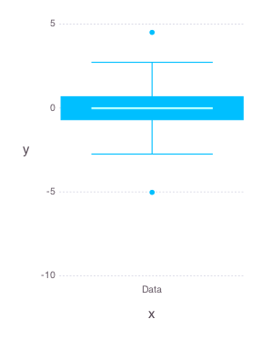

# FiveNumberSummary


````julia
using OnlineStats, Gadfly, DataFrames
````


### Create 5-number summary with the first batch
````julia
srand(619)
o = FiveNumberSummary(randn(100))
````


### Update model with many batches
````julia
for i = 1:1000
    update!(o, randn(100))
end
````


### Check estimate
````julia
julia> DataFrame(o)
1x6 DataFrame
| Row | min      | q1        | median     | q3       | max     | nobs     |
|-----|----------|-----------|------------|----------|---------|----------|
| 1   | -5.02526 | -0.695795 | -0.0139218 | 0.671007 | 4.50278 | 100100.0 |

julia> 
# Code for plotting a FiveNumberSummary oect (see src/plotmethods.jl)
function Gadfly.plot(o::OnlineStats.FiveNumberSummary)
    s = OnlineStats.state(o)
    iqr = s[4] - s[2]
    Gadfly.plot(
        Gadfly.layer(lower_fence = [maximum((s[2] - 1.5 * iqr, s[1]))],
              lower_hinge = [s[2]],
              middle = [s[3]],
              upper_hinge = [s[4]],
              upper_fence = [minimum((s[4] + 1.5 * iqr, s[5]))],
              # outliers = [s[1], s[5]],
              x = ["Data"], Gadfly.Geom.boxplot),
        Gadfly.layer(x = ["Data"], y=[s[1], s[5]], Gadfly.Geom.point))
end
plot (generic function with 9 methods)

julia> 
plot(o)

````





Boxplot whiskers have length 1.5*IQR.  Maximum and minimum are the only outliers available since quantiles are approximate.
