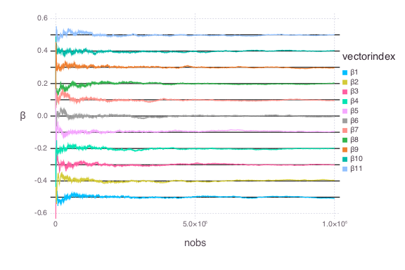

# LogRegMM


````julia
using OnlineStats, Distributions, StatsBase, Gadfly, DataFrames
````


### Function to help generate data
````julia
inverselogit(x) = 1 / (1 + exp(-x))
@vectorize_1arg Real inverselogit
````


### Create model with the first batch
````julia
β = [-.5:.1:.5]
X = [ones(100) randn(100, 10)]
y = int(inverselogit(X * β) .> rand(100))

o = LogRegMM(X, y, StochasticWeighting(.8))
df = DataFrame(o)  # Create DataFrame
````


### Update model with many batches
````julia
for i in 1:9999
    X = [ones(100) randn(100, 10)]
    y = int(inverselogit(X * β) .> rand(100))

    updatebatch!(o, X, y)
    push!(df, o)  # append results to DataFrame
end
````


### Check fit
````julia
julia> coef(o)
11-element Array{Float64,1}:
 -0.508147  
 -0.39576   
 -0.301666  
 -0.199603  
 -0.0958239 
 -0.00354185
  0.0952869 
  0.202132  
  0.296988  
  0.402697  
  0.501206  

julia> df_unpacked = unpack_vectors(df)
110000x3 DataFrame
| Row    | β           | nobs    | vectorindex |
|--------|-------------|---------|-------------|
| 1      | -0.26145    | 100     | β1          |
| 2      | -0.334335   | 100     | β2          |
| 3      | -0.645359   | 100     | β3          |
| 4      | -0.201841   | 100     | β4          |
| 5      | 0.00634207  | 100     | β5          |
| 6      | -0.0191632  | 100     | β6          |
| 7      | 0.0596975   | 100     | β7          |
| 8      | -0.0197586  | 100     | β8          |
⋮
| 109992 | -0.301666   | 1000000 | β3          |
| 109993 | -0.199603   | 1000000 | β4          |
| 109994 | -0.0958239  | 1000000 | β5          |
| 109995 | -0.00354185 | 1000000 | β6          |
| 109996 | 0.0952869   | 1000000 | β7          |
| 109997 | 0.202132    | 1000000 | β8          |
| 109998 | 0.296988    | 1000000 | β9          |
| 109999 | 0.402697    | 1000000 | β10         |
| 110000 | 0.501206    | 1000000 | β11         |

julia> plot(df_unpacked, x = :nobs, y = :β, color = :vectorindex, Geom.line,
            yintercept = β, Geom.hline(color = "black"),
            Scale.y_continuous(minvalue=-.6, maxvalue=.6))

````





