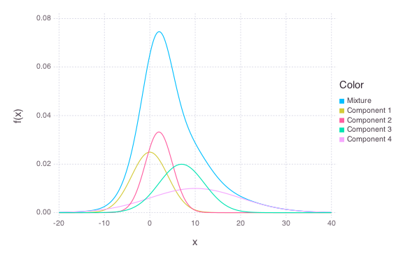
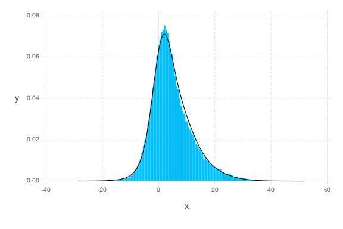
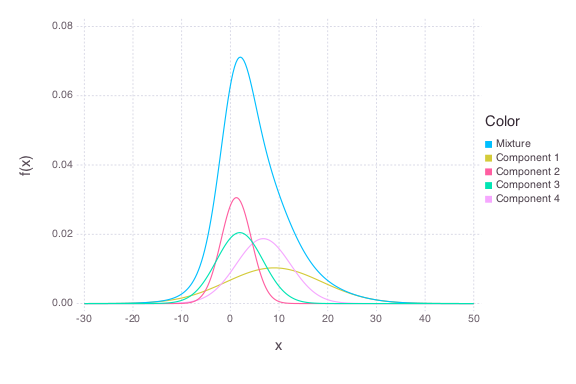

# NormalMix


````julia
using OnlineStats, Distributions, Gadfly

# add plot methods from plotmethods.jl
#--------------------------------------------------------------# Normal Mixture
function Gadfly.plot(o::MixtureModel{Univariate, Continuous, Normal}, a, b;
                     args...)
    plotvec = [x -> pdf(o, x)]
    legendvec = ["Mixture"]

    for j in 1:length(components(o))
        plotvec = [plotvec; x -> probs(o)[j] * pdf(components(o)[j], x)]
        legendvec = [legendvec; ["Component $j"]]
    end

    Gadfly.plot(plotvec, a, b, color = repeat(legendvec), args...)
end


#----------------------------------------# Normal Mixture overlaid on histogram
function Gadfly.plot(o::MixtureModel{Univariate, Continuous, Normal}, x;
                     args...)
    a = maximum(x)
    b = minimum(x)
    xvals = a:(b-a)/1000:b
    yvals = pdf(o, xvals)
    Gadfly.plot(Gadfly.layer(x = xvals, y=yvals, Gadfly.Geom.line, order = 1,
        Gadfly.Theme(default_color = Gadfly.color("black"))),
        Gadfly.layer(x = x, Gadfly.Geom.histogram(density = true), order = 0))
end
````


### True Model/Generate Data
````julia
srand(123)
trueModel = MixtureModel(Normal, [(0, 4), (2, 3), (7, 5), (10, 10)])
x = rand(trueModel, 100_000)
plot(trueModel, -20, 40)
````





### Create model with the first batch
````julia
obj = NormalMix(4, x[1:100])
````


````julia
OnlineNormalMix, nobs:100
MixtureModel{Normal}(K = 4)
components[1]
(prior = 0.1483): Normal(μ=14.453704167613214, σ=6.690122117916772)
components[2] (prior = 0.1025): Normal(μ=-3.4458131923369035,
σ=4.925055852102986)
components[3] (prior = 0.3690):
Normal(μ=1.8915158800377008, σ=3.2173221682007163)
components[4]
(prior = 0.3801): Normal(μ=8.213376299562198, σ=4.182344365948208)
````


### Update model with many batches of size 100
````julia
for i = 2:1000
    newvals = (i - 1) * 100 + 1 : 100 * i
    update!(obj, x[newvals])
end
````


### Check fit
````julia
plot(obj.d, x)
plot(obj.d, -30, 50)
````






