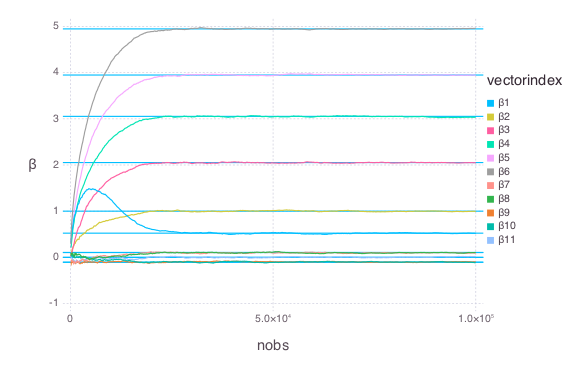

# QuantRegSGD


````julia
using OnlineStats, Distributions, StatsBase, Gadfly
````


### Generate Data: Location-Shift Model
````julia
beta = [0, 1, 2, 3, 4, 5, 0, 0, 0, 0, 0]
gamma = [0, 0, 1, 1, -1, -1, 2, 2, -2, -2, 0] / 10
````


### Generate data
````julia
X = [ones(100_000) randn(100_000, 10)]
errors = (1 + X * gamma) .* randn(100_000)
y = X * beta + errors
````


### Get trace data
````julia
df = tracedata(QuantRegSGD(11, τ = .7), 100, X, y, batch = true)
df_unpack = unpack_vectors(df)
````


### Create traceplot
````julia
julia> trueBeta = [quantile(Normal(), .7); beta + gamma * quantile(Normal(), .7)]
12-element Array{Float64,1}:
  0.524401
  0.0     
  1.0     
  2.05244 
  3.05244 
  3.94756 
  4.94756 
  0.10488 
  0.10488 
 -0.10488 
 -0.10488 
  0.0     

julia> plot(df_unpack, x = :nobs, y = :β, color = :vectorindex, Geom.line,
    yintercept = trueBeta, Geom.hline)

````





