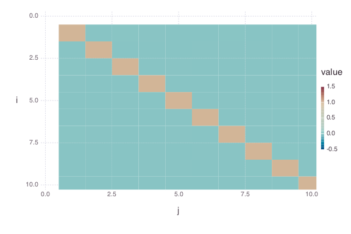

# CovarianceMatrix


````julia
using OnlineStats
using Gadfly
using StatsBase
````


### Create covariance matrix with the first batch
````julia
obj = CovarianceMatrix(10 * randn(100, 10))
````


### Update model with many batches
````julia
for i = 1:10000
    update!(obj, 10 * randn(100, 10))
end
````


### Check estimate

#### Columns means are available from `obj`
````julia
julia> mean(obj)
10-element Array{Float64,1}:
 -6.47985e-5
 -0.0142967 
 -0.00079486
  0.00938917
 -0.0034235 
 -0.0158189 
 -0.00903558
 -0.0063915 
  0.00532231
 -0.0110858 

````


#### Covariance Matrix or Correlation Matrix
````julia
julia> cov(obj)
10x10 Array{Float64,2}:
 100.013      -0.146892     0.179198   …   -0.142358     -0.13261   
  -0.146892   99.6293      -0.0154037      -0.137993     -0.222839  
   0.179198   -0.0154037  100.259          -0.112897      0.018043  
   0.0827606  -0.0609252   -0.180831        0.0558386    -0.0864265 
  -0.1026     -0.063473     0.0431237       0.102189     -0.00757571
  -0.0535326   0.128077    -0.127011   …   -0.0300097    -0.081919  
   0.216041    0.0895581   -0.0160841      -0.00724535    0.0109664 
   0.0077024   0.071761    -0.048406        0.188867     -0.0902417 
  -0.142358   -0.137993    -0.112897      100.105        -0.0687822 
  -0.13261    -0.222839     0.018043       -0.0687822   100.086     

julia> cor(obj)
10x10 Array{Float64,2}:
  1.0          -0.00147155    0.00178955   …  -0.00142274   -0.00132544 
 -0.00147155    1.0          -0.000154124     -0.00138177   -0.00223157 
  0.00178955   -0.000154124   1.0             -0.00112692    0.000180119
  0.000827157  -0.000610093  -0.00180511       0.000557826  -0.000863481
 -0.00102699   -0.000636564   0.000431123      0.00102241   -7.58025e-5 
 -0.000535065   0.00128261   -0.00126793   …  -0.000299812  -0.00081849 
  0.00215955    0.000896946  -0.00016058      -7.23912e-5    0.000109581
  7.70031e-5    0.000718795  -0.000483335      0.00188729   -0.000901842
 -0.00142274   -0.00138177   -0.00112692       1.0          -0.000687165
 -0.00132544   -0.00223157    0.000180119     -0.000687165   1.0        

julia> spy(cor(obj))

````




