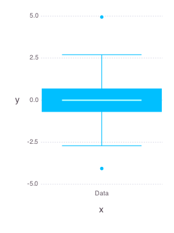

# FiveNumberSummary


````julia
using OnlineStats
using Gadfly
````


### Create 5-number summary with the first batch
````julia
obj = FiveNumberSummary(randn(100))
````


### Update model with many batches
````julia
for i = 1:1000
    update!(obj, randn(100))
end
````


### Check estimate
````julia
julia> state(obj)
7x2 Array{Any,2}:
 :min      -4.06803  
 :q25      -0.681794 
 :q50      -0.0052303
 :q75       0.671536 
 :max       4.94223  
 :n    100100.0      
 :nb     1001.0      

julia> plot(obj)

````





Boxplot whiskers have length 1.5*IQR.  Maximum and minimum are the only outliers available since quantiles are approximate.