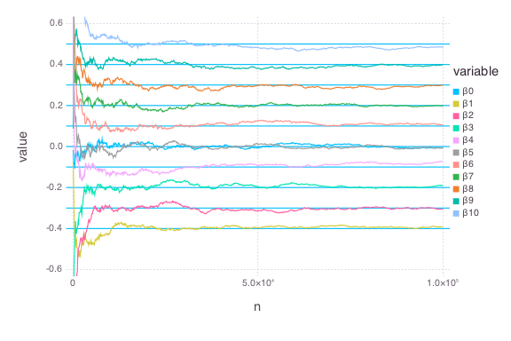

# LogRegMM


````julia
using OnlineStats
using Distributions, StatsBase, Gadfly, DataFrames
````


### Function to help generate data
````julia
logitexp(x) = 1 / (1 + exp(-x))
@vectorize_1arg Real logitexp
````


### Create model with the first batch
````julia
β = ([1:10] - 10/2) / 10
xs = randn(100, 10)
ys = vec(logitexp(xs * β))
for i in 1:length(ys)
    ys[i] = rand(Bernoulli(ys[i]))
end

obj = LogRegMM(xs, ys, r=.8)
df = make_df(obj) # Save estimates to DataFrame
````


### Update model with many batches
````julia
for i in 1:999
    xs = randn(100, 10)
    ys = vec(logitexp(xs * β))
    for i in 1:length(ys)
        ys[i] = rand(Distributions.Bernoulli(ys[i]))
    end

    update!(obj, xs, ys)
    make_df!(df, obj)  # append results to DataFrame
end
````


### Check fit
````julia
julia> coef(obj)
11-element Array{Float64,1}:
 -0.0176764 
 -0.398128  
 -0.296686  
 -0.19913   
 -0.119282  
  0.00143684
  0.0959933 
  0.196981  
  0.298916  
  0.401891  
  0.49446   

julia> df_melt = melt(df, 12:13)
11000x4 DataFrame
| Row   | variable | value    | n        | nb     |
|-------|----------|----------|----------|--------|
| 1     | β0       | 0.890816 | 100.0    | 1.0    |
| 2     | β0       | 0.635565 | 200.0    | 2.0    |
| 3     | β0       | 0.380392 | 300.0    | 3.0    |
| 4     | β0       | 0.312199 | 400.0    | 4.0    |
| 5     | β0       | 0.231199 | 500.0    | 5.0    |
| 6     | β0       | 0.208404 | 600.0    | 6.0    |
| 7     | β0       | 0.114914 | 700.0    | 7.0    |
| 8     | β0       | 0.151763 | 800.0    | 8.0    |
⋮
| 10992 | β10      | 0.49297  | 99200.0  | 992.0  |
| 10993 | β10      | 0.492149 | 99300.0  | 993.0  |
| 10994 | β10      | 0.492131 | 99400.0  | 994.0  |
| 10995 | β10      | 0.493273 | 99500.0  | 995.0  |
| 10996 | β10      | 0.493571 | 99600.0  | 996.0  |
| 10997 | β10      | 0.493302 | 99700.0  | 997.0  |
| 10998 | β10      | 0.493641 | 99800.0  | 998.0  |
| 10999 | β10      | 0.493127 | 99900.0  | 999.0  |
| 11000 | β10      | 0.49446  | 100000.0 | 1000.0 |

julia> plot(df_melt, x=:n, y=:value, color=:variable, Geom.line,
            yintercept=β, Geom.hline,
            Scale.y_continuous(minvalue=-.6, maxvalue=.6))

````





