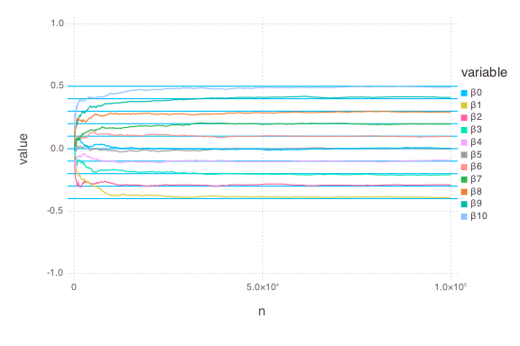

# LogRegSGD


````julia
using OnlineStats
using Distributions, StatsBase, Gadfly, DataFrames
````


### Function to help generate data
````julia
logitexp(x) = 1 / (1 + exp(-x))
@vectorize_1arg Real logitexp
````


### Create model with the first batch
````julia
β = ([1:10] - 10/2) / 10
xs = randn(100, 10)
ys = vec(logitexp(xs * β))
for i in 1:length(ys)
    ys[i] = rand(Bernoulli(ys[i]))
end

obj = LogRegSGD(xs, ys, r=.7)
df = make_df(obj) # Save estimates to DataFrame
````


### Update model with many batches
````julia
for i in 1:999
    xs = randn(100, 10)
    ys = vec(logitexp(xs * β))
    for i in 1:length(ys)
        ys[i] = rand(Bernoulli(ys[i]))
    end

    update!(obj, xs, ys)
    make_df!(df, obj)  # append results to DataFrame
end
````


### Check fit
````julia
julia> coef(obj)
11-element Array{Float64,1}:
  0.00327033 
 -0.401709   
 -0.303871   
 -0.210371   
 -0.0998627  
 -0.000260909
  0.0990221  
  0.198631   
  0.284075   
  0.397964   
  0.494625   

julia> df_melt = melt(df, 12:13)
11000x4 DataFrame
| Row   | variable | value     | n        | nb     |
|-------|----------|-----------|----------|--------|
| 1     | β0       | 0.08      | 100.0    | 1.0    |
| 2     | β0       | 0.0141889 | 200.0    | 2.0    |
| 3     | β0       | 0.0540097 | 300.0    | 3.0    |
| 4     | β0       | 0.0776297 | 400.0    | 4.0    |
| 5     | β0       | 0.0364289 | 500.0    | 5.0    |
| 6     | β0       | 0.0279391 | 600.0    | 6.0    |
| 7     | β0       | 0.0328007 | 700.0    | 7.0    |
| 8     | β0       | 0.0499297 | 800.0    | 8.0    |
⋮
| 10992 | β10      | 0.495736  | 99200.0  | 992.0  |
| 10993 | β10      | 0.495814  | 99300.0  | 993.0  |
| 10994 | β10      | 0.495752  | 99400.0  | 994.0  |
| 10995 | β10      | 0.496272  | 99500.0  | 995.0  |
| 10996 | β10      | 0.495848  | 99600.0  | 996.0  |
| 10997 | β10      | 0.495821  | 99700.0  | 997.0  |
| 10998 | β10      | 0.49573   | 99800.0  | 998.0  |
| 10999 | β10      | 0.495317  | 99900.0  | 999.0  |
| 11000 | β10      | 0.494625  | 100000.0 | 1000.0 |

julia> plot(df_melt, x=:n, y=:value, color=:variable, Geom.line,
            yintercept=β, Geom.hline,
            Scale.y_continuous(minvalue=-.75, maxvalue=.75))

````





