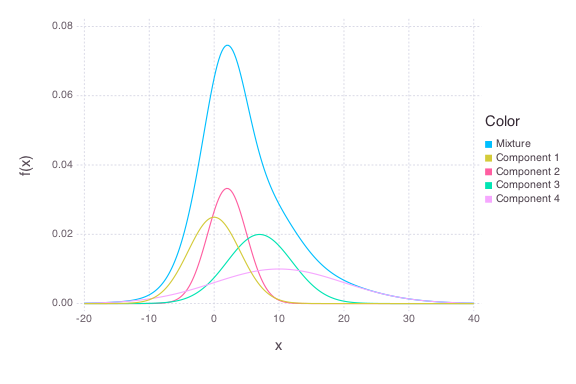
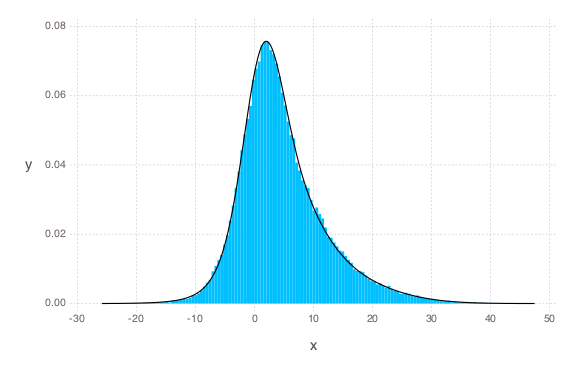
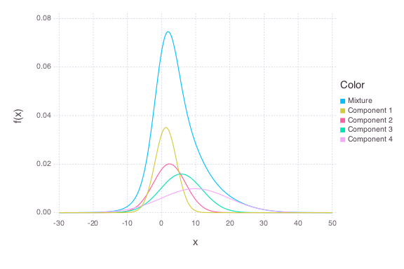

# OnlineNormalMix


````julia
using OnlineStats
using Distributions
using Gadfly
````


### True Model/Generate Data
````julia
trueModel = MixtureModel(Normal, [(0, 4), (2, 3), (7, 5), (10, 10)])
x = rand(trueModel, 100_000)
plot(trueModel, -20, 40)
````





### Create model with the first batch
````julia
obj = OnlineNormalMix(x[1:100], k=4)
````


````julia
OnlineNormalMix:
MixtureModel{Normal}(K = 4)
components[1] (prior =
0.2500): Normal(μ=-1.1944494924938276, σ=24.03501034917221)
components[2] (prior = 0.2500): Normal(μ=1.5149606027702482,
σ=24.03501034917221)
components[3] (prior = 0.2500):
Normal(μ=4.907028138228168, σ=24.03501034917221)
components[4] (prior
= 0.2500): Normal(μ=11.25007403030572, σ=24.03501034917221)
````


### Update model with many batches of size 100
````julia
for i = 2:1000
    newvals = (i - 1) * 100 + 1 : 100 * i
    update!(obj, x[newvals])
end
````


### Check fit
````julia
plot(obj.model, x)
plot(obj.model, -30, 50)
````






