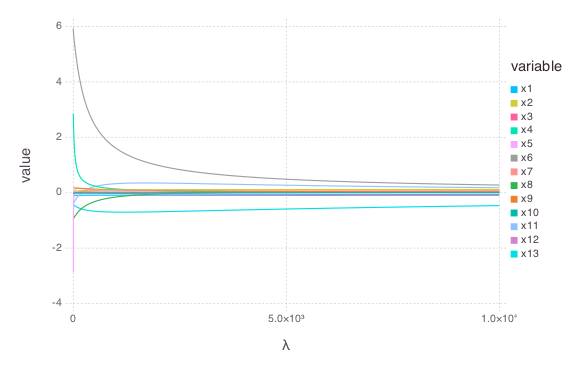

# RidgeReg


````julia
using OnlineStats, StatsBase, Gadfly, Distributions, DataFrames, RDatasets
````


### Get Boston Housing data
````julia
dt = dataset("MASS", "Boston")
y = array(dt[:MedV])
x = array(dt[:, 1:end-1])

y = convert(Vector{Float64}, y)
x = convert(Matrix{Float64}, x)
````


### Create model with the first batch
````julia
batch = 1:2
fit = RidgeReg(x[batch,:], y[batch], int=false)
````


### Update model with many batches
````julia
for i = 2:length(y)/2
    batch += 2
    update!(fit, x[batch, :], y[batch])
end
````


### Check fit
````julia
julia> coeftable(fit)
        Estimate  Std.Error    t value Pr(>|t|)
x1    -0.0928965   0.034421   -2.69883   0.0072
x2      0.048715  0.0144033     3.3822   0.0008
x3   -0.00405998  0.0644397 -0.0630044   0.9498
x4         2.854   0.903913    3.15738   0.0017
x5      -2.86844    3.35873  -0.854024   0.3935
x6       5.92815   0.309109    19.1782   <1e-60
x7   -0.00726933  0.0138145  -0.526209   0.5990
x8     -0.968514    0.19563   -4.95074    <1e-5
x9      0.171151  0.0667524    2.56397   0.0106
x10  -0.00939622 0.00392309   -2.39511   0.0170
x11    -0.392191   0.109869   -3.56961   0.0004
x12    0.0149056 0.00269654    5.52769    <1e-7
x13    -0.416304  0.0507862   -8.19719   <1e-14


julia> coeftable(fit, 1) # coefficients when λ = 1
        Estimate  Std.Error   t value Pr(>|t|)
x1     -0.088416  0.0432111  -2.04614   0.0413
x2     0.0891365  0.0169376   5.26265    <1e-6
x3    -0.0159714  0.0740599 -0.215655   0.8293
x4      0.239511    0.27507  0.870727   0.3843
x5      0.101777   0.282567  0.360187   0.7189
x6       2.44257   0.214187   11.4039   <1e-26
x7     0.0681646  0.0155246   4.39076    <1e-4
x8     -0.318021   0.183341  -1.73458   0.0834
x9      0.129107  0.0806863   1.60011   0.1102
x10  -0.00623673 0.00471056  -1.32399   0.1861
x11     0.221581   0.110394   2.00718   0.0453
x12    0.0240416 0.00329868   7.28826   <1e-11
x13    -0.669289  0.0572282  -11.6951   <1e-27


````


### Solution path
````julia
path = [coef(fit, 0)' 0]
for i in 0:10000
    path = [path; [coef(fit, i)' i]]
end

df = melt(convert(DataFrame, path), 14)
names!(df, [:variable, :value, :λ])
plot(df, x=:λ, y=:value, color=:variable, Geom.line)
````





