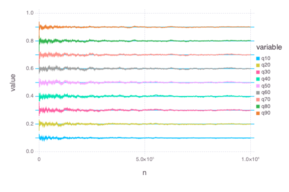
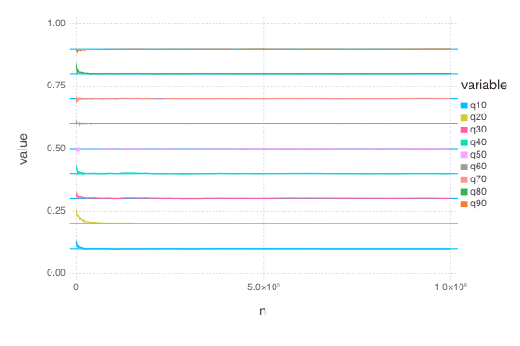

# Compare: `QuantileSGD` vs. `QuantileMM`


````julia
using OnlineStats
using Gadfly
using DataFrames
````


### Create model with the first batch
````julia
obj_sgd = QuantileSGD(rand(100), τ=[1:9]/10, r=.6)
obj_mm = QuantileMM(rand(100), τ=[1:9]/10, r=.6)
````


### Save results for trace plots

`make_df` constructs a `DataFrame` from any subtype of `OnlineStat`.

````julia
results_sgd = make_df(obj_sgd)
results_mm = make_df(obj_mm)
````


### Update model with many batches

`make_df!(df, obj)` adds a row to `df::DataFrame` using the current state of `obj<:OnlineStat`.  This is useful for generating trace plots.

````julia
srand(123)
@time for i = 1:9999
    update!(obj_sgd, rand(100))
    make_df!(results_sgd, obj_sgd)
end
````


````julia
elapsed time: 1.794185683 seconds (505490288 bytes allocated, 49.03%
gc time)
````


````julia
srand(123)
@time for i = 1:9999
    update!(obj_mm, rand(100))
    make_df!(results_mm, obj_mm)
end
````


````julia
elapsed time: 1.875505267 seconds (493971328 bytes allocated, 36.54%
gc time)
````


### Check estimates
````julia
julia> state(obj_sgd)
12x2 Array{Any,2}:
 :q10      0.0990649
 :q20      0.200543 
 :q30      0.299504 
 :q40      0.398423 
 :q50      0.498776 
 :q60      0.600991 
 :q70      0.701341 
 :q80      0.804396 
 :q90      0.901383 
 :r        0.6      
 :n        1.0e6    
 :nb   10000.0      

julia> state(obj_mm)
12x2 Array{Any,2}:
 :q10      0.0994492
 :q20      0.199849 
 :q30      0.299908 
 :q40      0.399933 
 :q50      0.500564 
 :q60      0.600628 
 :q70      0.700795 
 :q80      0.801095 
 :q90      0.900348 
 :r        0.6      
 :n        1.0e6    
 :nb   10000.0      

julia> 
# SGD: Maximum difference from truth
maxabs(obj_sgd.est - [1:9]/10)
0.004395945085507003

julia> 
# MM: Maximum difference from truth
maxabs(obj_mm.est - [1:9]/10)
0.0010954992068422653

````


### Check Traceplots
````julia
results_sgd_melt = melt(results_sgd, 10:12)
results_mm_melt = melt(results_mm, 10:12)

plot(results_sgd_melt, x="n", y="value", color="variable", yintercept=[1:9]/10, Geom.line, Geom.hline)
plot(results_mm_melt, x="n", y="value", color="variable", yintercept=[1:9]/10, Geom.line, Geom.hline)
````






