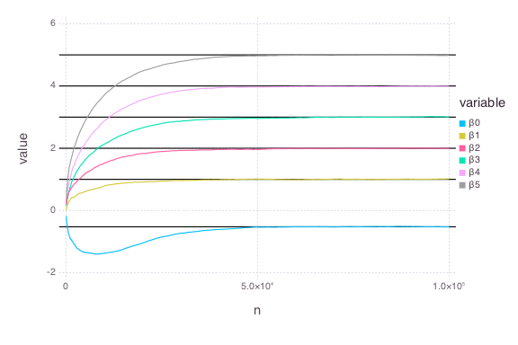
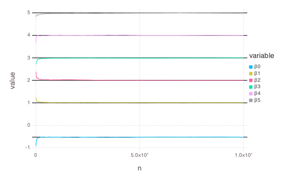

# Compare: `QuantRegSGD` vs. `QuantRegMM`


````julia
using OnlineStats
using Gadfly
using Distributions
using DataFrames
````


### Create model with the first batch

Specify starting value to be -10 for each coefficient.  We will see how well the models recover from poor starting values.

````julia
X = randn(100, 5)
y = vec(sum(X, 2)) + randn(100)

obj_sgd = QuantRegSGD(X, y, -10*ones(6) , τ=.3, r=.6)
obj_mm = QuantRegMM(X, y, -10*ones(6), τ=.3, r=.6)
````


### Save results for trace plots
````julia
results_sgd = make_df(obj_sgd)
results_mm = make_df(obj_mm)
````


### Update model with many batches
````julia
srand(123)
@time for i = 1:9999
	X = randn(100, 5)
    y = vec(sum(X, 2)) + randn(100)
    
    update!(obj_sgd, X, y)
    make_df!(results_sgd, obj_sgd)
end
````


````julia
elapsed time: 1.315678034 seconds (353256812 bytes allocated, 42.53%
gc time)
````


````julia
srand(123)
@time for i = 1:9999
	X = randn(100, 5)
    y = vec(sum(X, 2)) + randn(100)
    
    update!(obj_mm, X, y)
    make_df!(results_mm, obj_mm)
end
````


````julia
elapsed time: 1.588089959 seconds (412770620 bytes allocated, 41.68%
gc time)
````


### Check estimates
````julia
julia> coef(obj_sgd)
6-element Array{Float64,1}:
 -0.58486 
  0.970446
  0.978455
  0.971757
  0.970217
  0.973372

julia> coef(obj_mm)
6-element Array{Float64,1}:
 -0.526432
  0.997843
  1.003   
  0.999493
  1.00133 
  0.999852

julia> 
trueBeta = [quantile(Normal(), .3), ones(5)]
6-element Array{Float64,1}:
 -0.524401
  1.0     
  1.0     
  1.0     
  1.0     
  1.0     

julia> 
# SGD: Maximum difference from truth
maxabs(coef(obj_sgd) - trueBeta)
0.06045950565744185

julia> 
# MM: Maximum difference from truth
maxabs(coef(obj_mm) - trueBeta)
0.002995291537933875

````


### Check Traceplots

##### Stochastic Gradient Descent:
````julia
results_sgd = melt(results_sgd, 7:8)

plot(results_sgd, x="n", y="value", color="variable", yintercept=trueBeta, Geom.line, Geom.hline)
````





##### Online MM Algorithm:
````julia
results_mm = melt(results_mm, 7:8)

plot(results_mm, x="n", y="value", color="variable", yintercept=trueBeta, Geom.line, Geom.hline)
````





