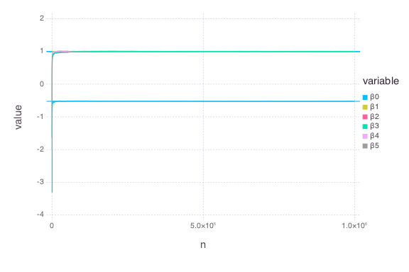

# Compare: `QuantRegSGD` vs. `QuantRegMM`


````julia
using OnlineStats
using Gadfly
using Distributions
using DataFrames
````


### Create model with the first batch
````julia
X = randn(100, 5)
y = vec(sum(X, 2)) + randn(100)

obj_sgd = QuantRegSGD(X, y, τ=.3, r=.6)
obj_mm = QuantRegMM(X, y, τ=.3, r=.6)
````


### Save results for trace plots
````julia
results_sgd = make_df(obj_sgd)
results_mm = make_df(obj_mm)
````


### Update model with many batches
````julia
srand(123)
@time for i = 1:9999
	X = randn(100, 5)
    y = vec(sum(X, 2)) + randn(100)
    
    update!(obj_sgd, X, y)
    make_df!(obj_sgd, results_sgd)
end
````


````julia
elapsed time: 1.232328465 seconds (351257892 bytes allocated, 40.25%
gc time)
````


````julia
srand(123)
@time for i = 1:9999
	X = randn(100, 5)
    y = vec(sum(X, 2)) + randn(100)
    
    update!(obj_mm, X, y)
    make_df!(obj_mm, results_mm)
end
````


````julia
elapsed time: 1.569508659 seconds (410771612 bytes allocated, 40.59%
gc time)
````


### Check estimates
````julia
julia> state(obj_sgd)
8x2 Array{Any,2}:
 :β0     -0.523693
 :β1      0.996968
 :β2      1.00592 
 :β3      0.997084
 :β4      0.998834
 :β5      0.999813
 :n       1.0e6   
 :nb  10000.0     

julia> state(obj_mm)
8x2 Array{Any,2}:
 :β0     -0.52791 
 :β1      0.99823 
 :β2      1.00406 
 :β3      0.999059
 :β4      1.00002 
 :β5      1.00002 
 :n       1.0e6   
 :nb  10000.0     

julia> 
trueBeta = [quantile(Normal(), .3), ones(5)]
6-element Array{Float64,1}:
 -0.524401
  1.0     
  1.0     
  1.0     
  1.0     
  1.0     

julia> 
# SGD: Maximum difference from truth
maximum(abs(obj_sgd.β - trueBeta))
0.005922231468715511

julia> 
# MM: Maximum difference from truth
maximum(abs(obj_mm.β - trueBeta))
0.0040552121192449775

````


### Check Traceplots
````julia
results_sgd = melt(results_sgd, 7:8)
results_mm = melt(results_mm, 7:8)

plot(results_sgd, x="n", y="value", color="variable", yintercept=trueBeta, Geom.line, Geom.hline)
plot(results_mm, x="n", y="value", color="variable", yintercept=trueBeta, Geom.line, Geom.hline)
````





