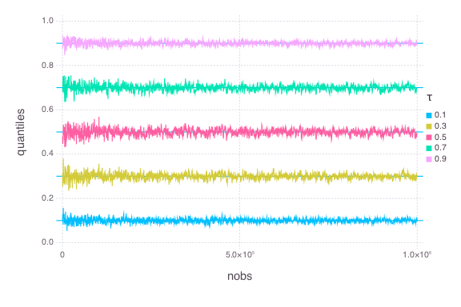
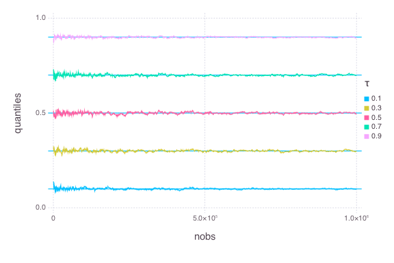

# Compare: `QuantileSGD` vs. `QuantileMM`


````julia
using OnlineStats, Gadfly, DataFrames
````


### Create data
````julia
x = rand(1_000_000)
````


Save data for traceplots

````julia
@time df_sgd = tracedata(QuantileSGD(τ = [.1:.2:.9]), 500, x)
@time df_mm = tracedata(QuantileMM(τ = [.1:.2:.9]), 500, x)
````


````julia
elapsed time: 0.281288578 seconds (10248040 bytes allocated, 25.78% gc
time)
elapsed time: 0.287433214 seconds (10883072 bytes allocated)
````


### Make Traceplots
Put DataFrames in traceplot-friendly format
````julia
df_sgd_unpacked = unpack_vectors(df_sgd)
df_mm_unpacked = unpack_vectors(df_mm)
````


````julia
plot(df_sgd_unpacked, x = :nobs, y = :quantiles, color = :τ,
    yintercept=[.1:.2:.9], Geom.line, Geom.hline, Scale.color_discrete)

plot(df_mm_unpacked, x = :nobs, y = :quantiles, color = :τ,
    yintercept=[.1:.2:.9], Geom.line, Geom.hline, Scale.color_discrete)
````






